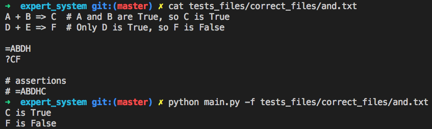
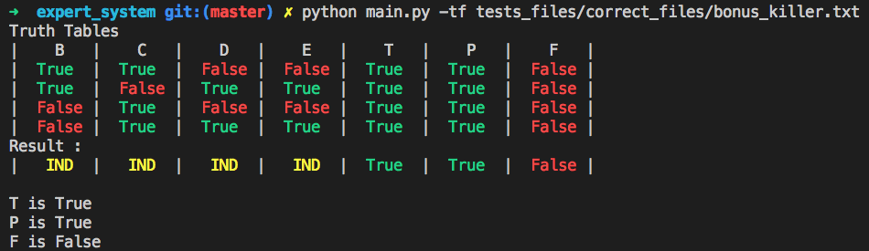
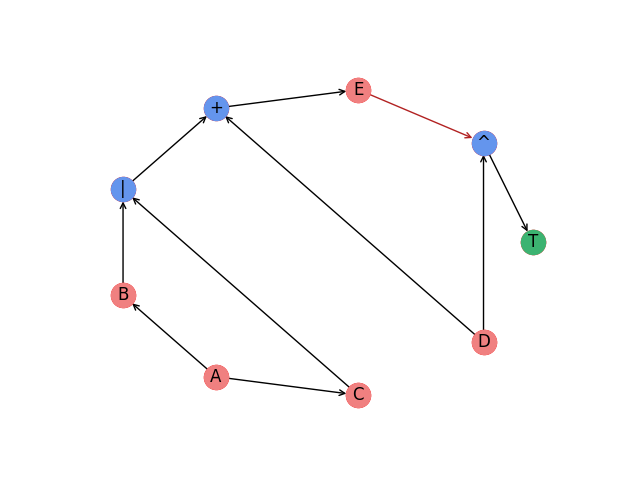

[](https://www.python.org/downloads/release/python-360/)
[](https://travis-ci.org/fxbabin/expert_system)


# expert system

Expert system is a 42 project where you have to propose a solver for a expert system . This project was realised with [arobion](https://github.com/arobion).

Expert systems are composed of rules (which implies letters, example : A + B => C), initial facts (example : =A) and queries (example : ?C). All the rules defines the relationship between letters (they are gathered into a graph, the expert system). Then some (or no) letters are set to true (=ABC), they are the initial facts. Finally, depending on the initial facts we look at the final state (True or False) of the queried letters.

```
A + B => C

=AB

?C # C is true if A and B are True else it is False (except if C is set to True at the beginning of course)
```

## Usage :

and.txt

```
A + B => C  # A and B are True, so C is True
D + E => F  # Only D is True, so F is False

=ABDH
?CF
```
simple command :
```
python main.py -f tests_files/correct_files/and.txt
```
command with all options :
```
python main.py -itf tests_files/correct_files/and.txt -g "CF"
```

### Options :

| Option | Description |
| --- | --- |
| i | interactive mode (reask for new initial facts at the end) |
| t | truth tables (show truth tables when or/xor are met in implies) |
| g | graph view for letter (generate picture of dependencies for a letter) |

### Ouput example (for simple cases):


### Ouput example (for complex cases with truth tables):


## Graphical output :
```
A => B ^ C
A => C ^ D
(B | C) + D => E
!E ^ D => T
E | C => P
E ^ D => F

=A

?TPF # T and P are True, F is False
```


## Requirements :

| Library | version |
| --- | --- |
| Python | 3.7.1 |
| matplotlib | 3.0.3 |
| networkx | 2.2 |

## Bonus:

5 bonus were done in this project:
- double implies (A + B <=> C)
- or and xor in implies
- truth table display for or and xor
- interactive fact change option
- graphical output generation

Mark: (125/125)
